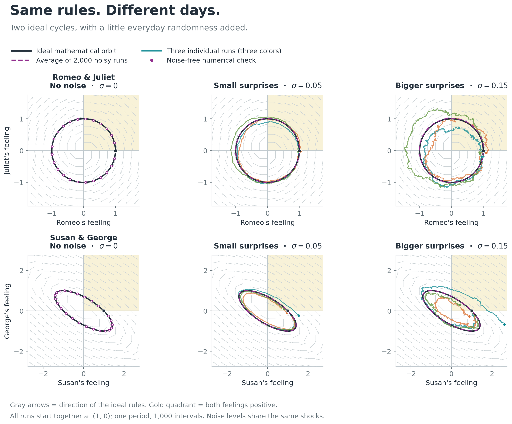

# Love, feedback, and George Costanza

*Influenced by PHYS 4410 Nonlinear Dynamics.*

An article and reproducible figures connecting linear relationship models to a small Fable conversation experiment. The models use illustrative response strengths and noise levels, not fitted relationship data.

Read [the article](article.md). For Obsidian, copy [the Markdown with hosted images](article-obsidian.md) into your existing note; those image links require internet access.

## Reproduce the article figures

```bash
uv run illustrate-dynamics.py
```

This generates `article-dynamics-results.json` and figures 08/09. The first overlays the ideal relationship orbits and direction fields with noisy equation simulations. The second checks the assigned response rules against saved Fable conversation results. It makes no model requests and needs no credentials. Exact settings, trajectory counts, and numerical checks are recorded in the generated JSON.

## The Fable pilot

Four short trajectories—two Romeo–Juliet and two Susan–George—attempted five encounters each. Jev rated the focal character's possible approaches, a seeded draw selected one, Kimi wrote both voices, and Scout appraised the exchange. Validated appraisals updated Fable's native state and a separate experimental affection variable before the next encounter.

The run made 60 model requests: 19 encounters passed validation and one was rejected. These are descriptive observations, not evidence that conversational agents reproduce the ideal cycles. The article explains measurement, clipping, and conversation-timing effects.

Regenerate the more detailed pilot figures (06/07) from the frozen, sanitized results, with no model calls or credentials:

```bash
uv run analyze-fable.py --from-export fable-pilot-results.json
```

The [results](fable-pilot-results.json) include generated dialogue, Jev selection probabilities, warmth ratings, state updates, and mathematical controls. Private prompts, credentials, and Fable application source are excluded.

The new research adapter is in `scripts/research/love-affairs/`. **It requires the existing Fable application checkout and its dependencies; this public repository alone cannot rerun the provider experiment.** Its relative imports deliberately refer to that application. To run it in an authorized Fable checkout, place the adapter at that same path and configure the required provider credentials locally:

```bash
# Dry plan: no provider requests.
npx tsx --env-file=.env.local scripts/research/love-affairs/run.ts \
  --output scratchpad/love-affairs-plan

# Live: four trajectories, five attempts each; fresh output and ledger paths.
# Requires TYPESAFE_API_KEY, AWS_ACCESS_KEY_ID, AWS_SECRET_ACCESS_KEY,
# AWS_REGION=us-east-1, BEDROCK_MODEL_ID=moonshot.kimi-k2-thinking.
npx tsx --env-file=.env.local scripts/research/love-affairs/run.ts \
  --live --steps 5 --max-calls 60 --max-usd 2 \
  --output scratchpad/love-affairs-new-run \
  --ledger scratchpad/love-affairs-new-budget.json
```

The budget is a conservative admission estimate, not a provider-enforced billing ceiling. The local seeds control categorical selection only; new provider responses need not reproduce the saved dialogue or ratings. The adapter invokes the existing core in memory and does not enable or write to the live game.

## Reproduce the mathematical baseline

With [uv](https://docs.astral.sh/uv/) installed, run:

```bash
uv run simulate.py
```

The script declares its Python version and exact dependency versions. It writes `results.json` and five figures in PNG and SVG formats to `figures/` beside the script.

The experiments use seed `20260927`, 10,000 runs for each of four models under two conditions (80,000 trajectories total), and a separate 40,000 draws of perturbed response matrices. Each trajectory spans $4\pi$ time units (two periods of the cycling models), with 1,000 intervals. Exact linear stochastic updates preserve the analytical mean and covariance at the observation times.

The script also checks the deterministic solutions against an independent differential-equation solver, the closed-form cycle overlaps, and the stochastic covariance against numerical integration. Small floating-point differences across platforms are possible.

## Files

- [Article](article.md)
- [Article figure code](illustrate-dynamics.py) and [results](article-dynamics-results.json)
- [Conversation results](fable-pilot-results.json) and [figure code](analyze-fable.py)
- [Linear simulation code](simulate.py) and [numerical validation](results.json)
- [Graphs](figures/)


