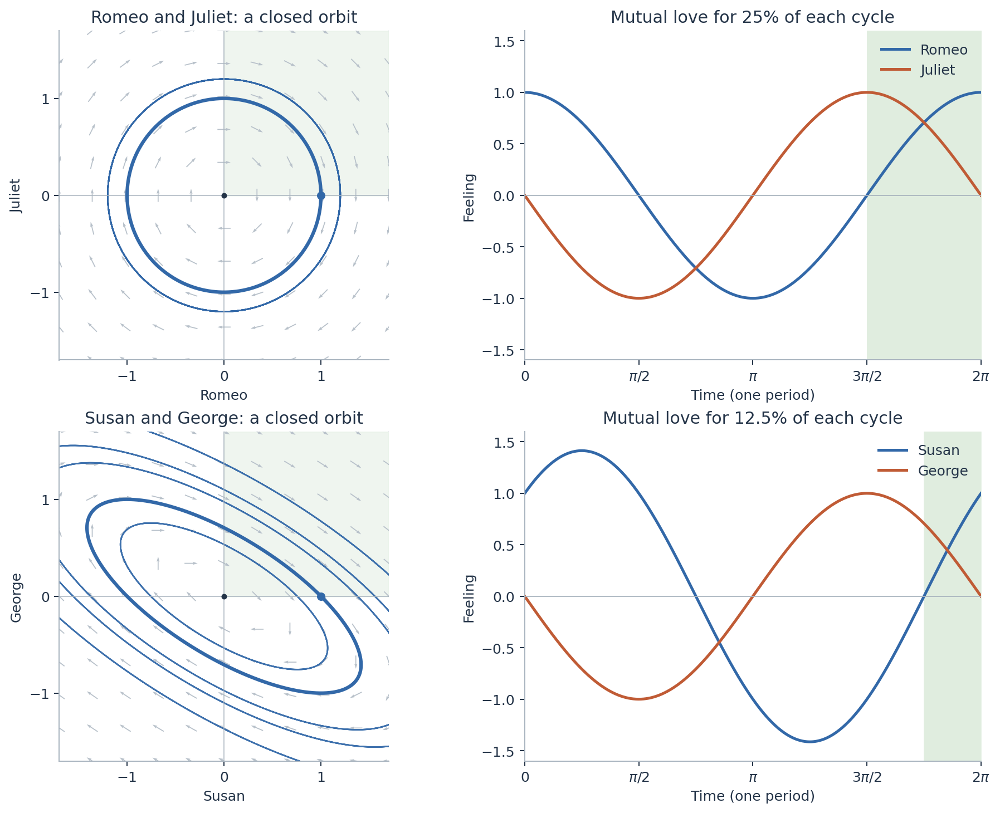

# Love, feedback, and bad timing

*Influenced by PHYS 4410 Nonlinear Dynamics.*

Reproducible simulations of linear relationship models: Romeo and Juliet, Susan and George from *Seinfeld*, cautious couples, and other feedback patterns. The models use illustrative response strengths and noise levels, not fitted relationship data.

## Reproduce the results

With [uv](https://docs.astral.sh/uv/) installed, run:

```bash
uv run simulate.py
```

The script declares its Python version and exact dependency versions. It writes `results.json` and five figures in PNG and SVG formats to `figures/` beside the script.

The experiments use seed `20260927`, 10,000 runs for each of four models under two conditions (80,000 trajectories total), and a separate 40,000 draws of perturbed response matrices. Each trajectory spans $4\pi$ time units (two periods of the cycling models), with 1,000 intervals. Exact linear stochastic updates preserve the analytical mean and covariance at the observation times.

The script also checks the deterministic solutions against an independent differential-equation solver, the closed-form cycle overlaps, and the stochastic covariance against numerical integration. Small floating-point differences across platforms are possible.

## Files

- [Simulation code](simulate.py)
- [Numerical results and validation](results.json)
- [Graphs](figures/)


