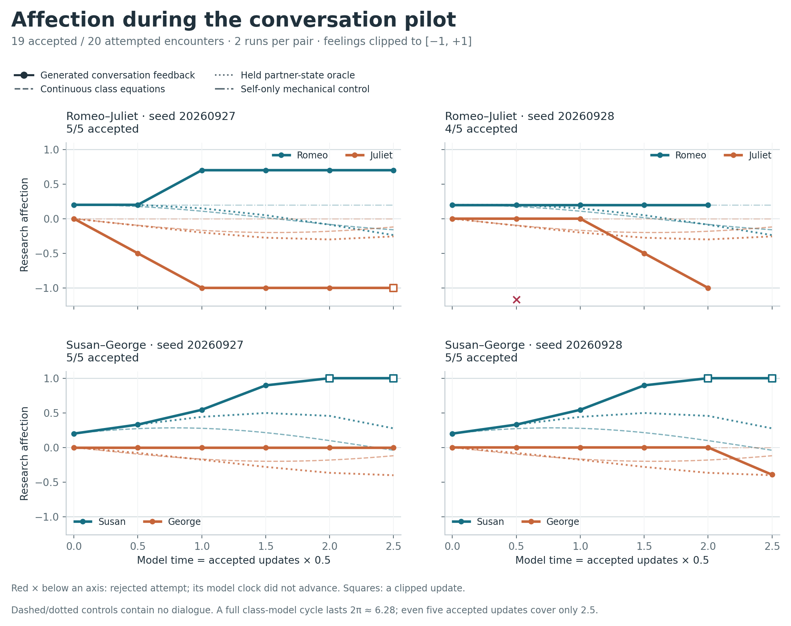
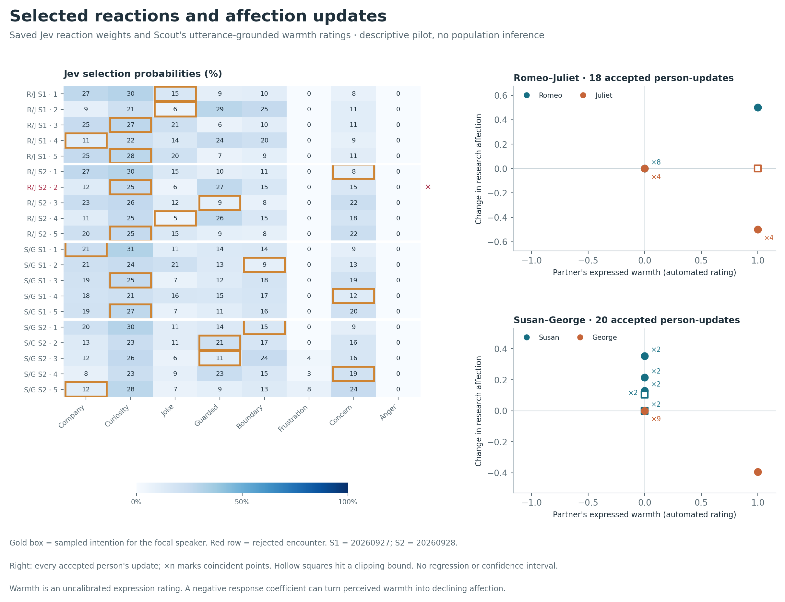
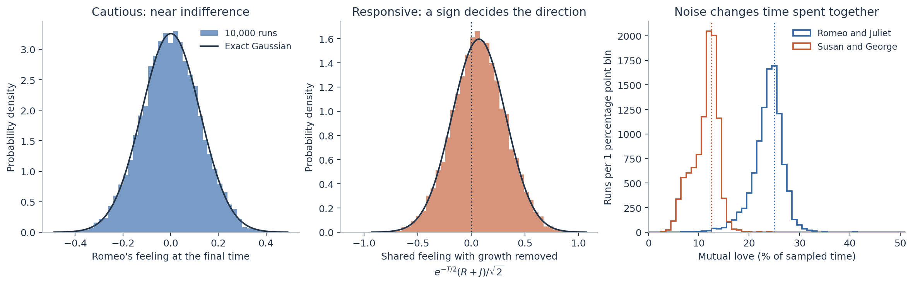

# When affection has to survive a conversation

*Influenced by PHYS 4410 Nonlinear Dynamics.*

> **Susan:** “We could just sit for a bit. No perfect sentences required.”
>
> **George:** “That's... a novel approach. I think I can manage that.”

After this exchange, George’s simulated affection fell from **0 to −0.393**. Susan had offered something the observer classified as warm; George’s assigned response policy reacted against warmth. His polite reply came before that numerical update.

These lines came from Fable’s actual conversation pipeline. The experiment adds a question to its existing social simulation: **what happens when a mathematically defined emotional sensitivity must operate through spoken language?** The conversations ran and feelings changed, but these short paths departed from the classroom predictions. The run was too short to test a complete cycle; it did expose where language, timing, and the chosen response rules change the trajectory.

Each character has a new, directed affection value $r_i\in[-1,1]$: hostility at $-1$, indifference at $0$, affection at $+1$. Susan’s feeling toward George belongs to Susan; it says nothing about his reciprocal feeling. Fable’s existing broad relationship score remains separate. A character can show ordinary social warmth while a deliberately contrarian affection policy moves in the other direction. Neither score measures a percentage of human love.

The feedback loop begins with **Jev**, before anyone speaks. Jev rates eight possible approaches for the focal character, including friendly company, curiosity, guarded conversation, boundaries, and confrontation. Jev receives that character’s disposition, needs, memories, directed relationship, and current private affection. Its probabilities over suitability levels 0–3 give an expected score $s_i$, which yields weight $w_i=s_i^2$ if $s_i\ge1$; otherwise its weight is zero. Dividing by the total produces selection probabilities $p_i=w_i/\sum_jw_j$. A categorical draw chooses one approach. Plausible alternatives retain a chance; Jev does not simply pick its highest score.

**Kimi writes both sides of the conversation**, preserving the selected focal approach while giving the counterpart a response. The writer receives both private affection values, with instructions that characters cannot read each other’s hidden state. The focal character alternates between encounters. A separate **Scout appraisal** then assesses consequences under Fable’s existing rules and supplies an additional research observation: the warmth or hostility conveyed toward each listener by the partner’s actual words.

Every observation must identify its listener, counterpart speaker, and an exact quoted line. It measures expressed warmth, not whether the listener enjoys receiving it. The observer never receives the private numeric affection values. Native validation and this extra evidence check must both pass before any state changes. Accepted encounters update Fable’s ordinary needs and directed bonds, retain dialogue history and quoted memories, and update affection. Those become context for the next conversation.

This pilot used the existing pipeline with synthetic adults and in-memory state; it changed no live game. It preserved native appraisal rules but omitted production memory extraction, fact extraction, passive decay, and scheduling. The new affection field and response coefficients are explicit experimental additions, not capabilities inferred from an existing bond score.

The mathematical rule is $\dot r_i=a_i r_i+b_i u_{j\to i}$. A dot means rate of change. The input $u_{j\to i}\in[-1,1]$ is warmth expressed by the partner toward this character. Positive $a_i$ reinforces existing feelings; negative $a_i$ lets them fade. Positive $b_i$ reciprocates warmth; negative $b_i$ opposes it. These signs give four styles: eager $(+,+)$, cautious $(-,+)$, self-reinforcing contrarian $(+,-)$, and restrained contrarian $(-,-)$.

Romeo has $(a,b)=(0,1)$ and Juliet $(0,-1)$. Susan has $(1,2)$ and George $(-1,-1)$. Their prose personalities set voice—expressive, guarded, earnest, wry—while these numerical coefficients define their emotional response. Choosing the coefficients **builds a behavior into the simulation**. It does not discover that behavior in people or establish that Fable’s original characters already follow these laws.

After each accepted conversation, its observation is held constant for $h=0.5$ model-time units. The exact update before bounding is $\tilde r_i=e^{a_i h}r_i+b_i\phi(a_i,h)u_{j\to i}$, where $\phi(a,h)=(e^{ah}-1)/a$ for $a\ne0$ and $\phi(0,h)=h$. Values outside $[-1,1]$ are clipped. Holding the signal constant means no fresh emotional evidence arrives during that interval. The code records both the unclipped value and the bounded result.

For George, the opening exchange gives $r=0$, $u=1$, $a=b=-1$: the update is $-(1-e^{-0.5})\approx-0.393$. The same words would increase affection for a reciprocating character. This sensitivity is the experiment’s designed mechanism; the observer’s interpretation of the words remains a separate, uncertain measurement.

The live pilot attempted **20 encounters across four trajectories**: two couples, two reaction seeds per couple, five sequential attempts each. All started at $(0.2,0)$, with no random starting deviations or added Gaussian disturbances. There were **60 provider requests**—20 Jev ratings, 20 Kimi conversations, 20 Scout appraisals—and **19 accepted encounters**. One appraisal failed the native grounding/consequence checks. That attempt changed neither state nor model time and was not retried.

The models were Jev **1.13.0**, **Kimi K2 Thinking**, and **Llama 4 Scout**. Writer temperature was **0.8**, appraisal temperature **0.2**, with output limits of **16,000** and **1,536** tokens. Temperature changes sampling behavior; it is not a specified variance of feelings. Local reaction seeds were **20260927** and **20260928**, offset by 1000 for Susan–George. They control the categorical draws, not provider language generation or ratings. Replaying a seed does not guarantee identical conversations.

*Time advances only after accepted encounters. The controls are calculations without generated dialogue; each comparison uses the same accepted-update clock.*

The two Romeo–Juliet trajectories ended at **$(0.7,-1)$** and **$(0.2,-1)$**. The latter had only four accepted updates, ending at $t=2$ rather than $2.5$. Several lines from Romeo were rated warm, including “I might just like the sound of your answers.” Juliet’s negative response coefficient converted that warmth into declining affection. In one run, both native bond scores nevertheless rose from 0 to 1. Ordinary social familiarity and this experimental affection rule can disagree.

Susan–George ended at **$(1,0)$** and **$(1,-0.393)$**. Susan hit the upper bound in both runs, but that was **not evidence that George’s conversations made her fall in love**. Every observed George-to-Susan input was zero. Her positive self-feedback alone produced $0.2e^t$, reaching the bound at the fourth accepted update. The control with partner responsiveness switched off, $b=0$, follows precisely that rise. George stayed at zero until a single warm observation in the second run’s last encounter produced the opening example.

The dialogue still developed recognizable themes. In one run George described their situation as “a ceasefire”; later he said, “I think the fact that I'm still calling it a ceasefire answers that. I'm not there yet.” In the other, they kept circling the difficulty of speaking plainly. Different conversations sometimes produced the same numerical input.

*Left: Jev’s selection probabilities; gold boxes mark the sampled approach. Right: observed warmth versus the resulting affection change. Overlapping points are counted, and squares mark clipping. These are recorded updates, not a fitted relationship.*

Across the **38 accepted directional observations**, Scout returned **31 zeros and seven ones**, with no negative or intermediate values. A continuous scale had effectively become binary in this sample. Exact quotations make the decisions inspectable, but they do not validate the scale: “Then we figure out the next step together. No ambush.” received zero, while other modest expressions received one. The same appraiser also sees contextual information and the selected intention, so this is not a blinded measurement. Two trajectories per couple cannot establish a reliable distribution or show that the added affection field causally changed the language.

The classroom model supplies a useful counterpoint. If each person continuously responds to the partner’s actual feeling, Romeo–Juliet obey $\dot R=J$, $\dot J=-R$. From $(1,0)$, $R=\cos t$ and $J=-\sin t$: an endless cycle of period $2\pi$, with mutual affection for **25%** of each period. For Susan $x$ and George $y$, the equations are $\dot x=x+2y$, $\dot y=-x-y$. Their solution is $x=\cos t+\sin t$, $y=-\sin t$, with mutual affection for **12.5%**, mutual hostility for 12.5%, and opposite signs for 75%. Scaling the initial state to $(0.2,0)$ preserves those fractions.

Even a perfect conversational observer would not automatically recover those loops. Replace spoken warmth with the partner’s true feeling, but observe it only every half-unit: Romeo–Juliet’s radius grows by $\sqrt{1+h^2}\approx1.118$ per step. Each scalar update is exact; the change comes from holding stale information between observations. The matched Susan–George control ends near $(0.276,-0.402)$ after five updates, whereas the continuous solution then has both feelings negative. Timing alone changes the result. Clipping changes it further, and five accepted encounters cover only $2.5$ units—less than one $2\pi$ cycle.

The other relationship types offer different comparison patterns:

| Relationship rule | What the equations predict |
|---|---|
| Two cautious reciprocators: $\dot R=-\kappa R+\rho J$, $\dot J=\rho R-\kappa J$ | Disagreement fades. Shared feeling fades when $\kappa>\rho$, amplifies when $\rho>\kappa$, and stays at the initial average when equal. |
| Eager plus cautious, with positive reciprocity | A saddle: some directions fade while another grows. |
| Escalating cycles: $\dot R=J$, $\dot J=-R+J$ | An outward spiral rather than a repeating loop. |
| Only reacting to each other: $\dot R=aJ$, $\dot J=bR$ | Cycles for $ab<0$; a saddle for $ab>0$. |
| “Fire and water”: $\dot R=aR+bJ$, $\dot J=-bR-aJ$ | Cycles when $b^2>a^2$; a saddle when $a^2>b^2$. At equality, constant states or linear drift. |
| Identical styles: $\dot R=aR+bJ$, $\dot J=bR+aJ$ | Shared feeling grows or fades at rate $a+b$; disagreement at $a-b$. Similarity can amplify opposition. |
| Unwavering partner: $\dot R=0$, $\dot J=aR+bJ$ | For $b<0$, Juliet approaches $-aR_0/b$; for $b>0$, deviations grow. At $b=0$, change is linear in time. |

Those are mathematical baselines; only Romeo–Juliet and Susan–George received conversations here.

Separate numerical experiments tested how the smooth equations survive randomness: **80,000 trajectories**, comprising four models × two noise conditions × 10,000 runs. The models were the two cycles and cautious pairs with $(\kappa,\rho)=(1,0.5)$ or $(0.5,1)$. Independent Gaussian starting deviations had standard deviation **0.20**; the noisy condition also added independent Brownian disturbances of strength **0.15**. Starting means were $(1,0)$ except $(0.2,-0.1)$ for cautious growth. Both conditions reused the same initial draws. Each run covered $4\pi$ time units in 1,000 intervals, using seed **20260927** and exact linear stochastic updates.

Variance measures squared spread; standard deviation gives spread in the original units. Brownian increments over duration $h$ have variance $0.15^2h$, so their standard deviation scales as $0.15\sqrt h$. Fixed-time states remain Gaussian under these linear equations and Gaussian inputs. Time spent jointly affectionate can have a different distribution.

Noisy Romeo–Juliet runs averaged **23.67%** of sampled time in mutual affection, with a middle 95% range of **16.3–28.7%**. Susan–George averaged **11.27%**, with **5.9–15.2%**. These ranges describe variation between runs, not uncertainty about an average. Another **40,000 coefficient draws**—10,000 per model, independent Gaussian coefficient deviations of standard deviation **0.05**—showed how fragile perfect cycles are: small changes commonly turn them into fading or expanding spirals. These were coefficient classifications, not additional conversations.

The conversation pilot exposes a different problem. A hidden feeling must become speech, that speech must be interpreted, and the interpretation must become a response. Here the observer often flattened distinct dialogue into zero, while self-amplification and clipping could dominate the graph. The next useful test is a calibrated expression measure and matched conversational reruns with partner responsiveness disabled. More simulation alone would only measure the current assumptions more precisely.

The code, results, and graphs are available on [GitHub](https://github.com/twgao/relationship-modeling).
