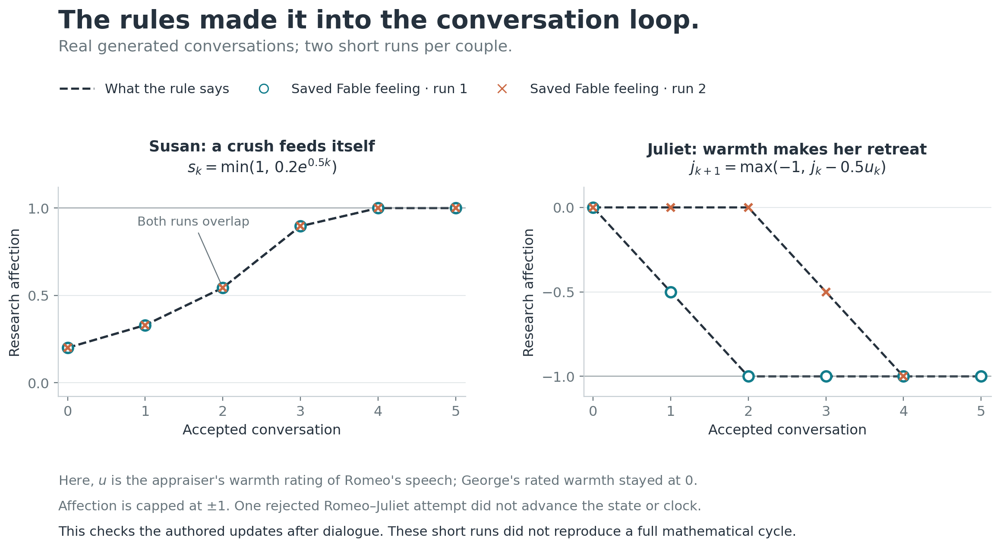

# Love, feedback, and George Costanza

*Influenced by PHYS 4410 Nonlinear Dynamics.*

A fictional relationship is a feedback loop with a memory. Someone leans in; the other backs off. That retreat changes the next conversation. Repeat often enough and you get devotion, indifference, or an entire sitcom.

Fable makes this something we can experiment with. Its characters bring personalities, needs, and memories into conversations, then react to what happened. Here we add a numerical feeling toward the other person and a rule for how it changes. **Can a relationship pattern from a few equations survive contact with actual dialogue?**

Start with a feeling as a number: positive means affection, negative means hostility, and zero means indifference. Each direction belongs to a different person. Susan liking George says nothing about George liking Susan.

The rule is $\dot r=ar+bu$: the rate of change in a feeling combines its own momentum with a response to the partner. The first term can reinforce or fade an existing feeling; the second can reciprocate or oppose the incoming signal. In the mathematical version, that signal is the partner’s current feeling.

Romeo responds positively to Juliet, while Juliet reacts against Romeo. When he warms up, she cools down; eventually her coldness cools him down, giving her room to warm up again. The equations produce a repeating loop. In the Susan–George example from *Seinfeld*, Susan’s feelings reinforce themselves and respond twice as strongly to George. George’s feelings fade on their own and oppose Susan’s. That also produces a loop, with considerably worse timing.

Both ideal cycles take $2\pi$ units of model time. Romeo and Juliet are simultaneously affectionate for **25%** of a cycle; Susan and George manage **12.5%**. Different rules give other familiar stories: two cautious reciprocators can settle into indifference, while stronger reinforcement can turn oscillation into an expanding spiral.

*Each point is a pair of feelings. The arrows show where the equations push that pair next. Black curves are the ideal loops; colored paths are individual simulations; the dashed curve is the average.*

**The numerical simulations reproduce those ideal loops.** The noise-free points sit on the mathematical curves. Then we keep the same starting feelings and add random disturbances: small, zero-mean Gaussian pushes to each person. The noise strength sets their size: tripling it multiplies the variance—the spread around zero—by nine.

The overlay uses **8,000 noisy trajectories**: 2,000 per couple at each of two noise levels ($\sigma=0.05$ and $0.15$), plus two noise-free checks. Each runs for one ideal cycle. Larger noise spreads out individual stories, while the average remains close to the ideal path. More simulations estimate that spread more precisely; they do not make individual stories less noisy.

At the higher noise level, Romeo–Juliet spent an average **22.6%** of the cycle mutually affectionate; the middle 95% of runs ranged from 13.5–29.0%. Susan–George averaged **9.7%**, with a range of 0–15.2% for the middle 95%. Those ranges describe individual stories. The average orbit can look ideal while couples spend less time liking each other.

For Fable, the incoming signal becomes **warmth expressed in the partner’s words**. The loop is **Jev → sampled approach → conversation → appraisal → updated feelings**. Jev rates approaches using one character’s current feelings and context. A sampled approach guides Kimi, which writes both voices. Scout then assesses the exchange and supplies a warmth rating supported by an exact quote. The response rule converts that rating into a change in affection; the new feeling and conversation history feed the next encounter.

We bound this added affection score between −1 and +1 and keep it separate from Fable’s ordinary relationship score. The characters’ response rules are deliberately assigned. We are testing what those rules do through conversation, rather than discovering anyone’s personality from dialogue.

The pilot ran **four short trajectories: two per couple, five attempted conversations each**. That meant 20 attempts, 19 accepted conversations, and 60 model requests. One failed validation and changed no state; each accepted conversation advanced half a unit of model time. These runs added **no Gaussian noise**: variation came from the sampled approaches, generated dialogue, and model ratings.

*Replaying the assigned rule on the recorded warmth ratings matches the saved states. This checks the response mechanism, not a complete conversational cycle.*

Susan’s two traces follow the same predicted rise, $0.2e^t$, until they hit the upper bound. Every George-to-Susan warmth rating was zero: her own emotional momentum drove the increase. Juliet’s affection fell when Romeo’s words were rated warm, exactly as her contrarian rule requires.

George provided the most compact demonstration:

> **Susan:** “We could just sit for a bit. No perfect sentences required.”
>
> **George:** “That's... a novel approach. I think I can manage that.”

Scout rated Susan’s words as warm. George’s assigned rule then moved his affection from **0 to −0.393**. His polite reply had already happened; the numerical reaction would inform the next conversation. Apparently, agreeing to sit together can still be a setback on George’s affection graph.

The language measurement needs work: **31 of 38 accepted directional ratings were zero; the other seven were one**. Distinct conversations often became the same number. Updating between conversations also changes the dynamics, and these runs cover less than half an ideal cycle. The mathematical cycles are reproduced; the Fable pilot verifies the assigned response rules working on dialogue. Whether longer runs with better-calibrated warmth ratings sustain those cycles remains an open—and much more interesting—test.

Code, results, and graphs are on [GitHub](https://github.com/twgao/relationship-modeling).
